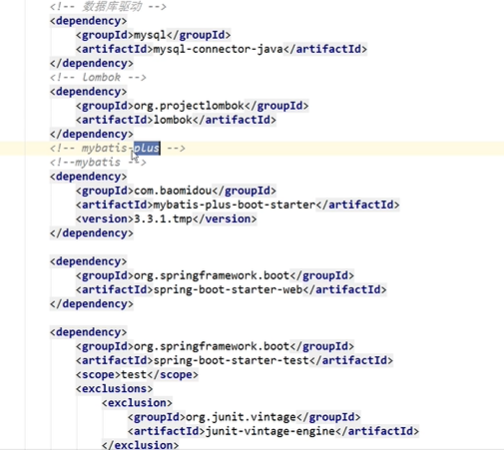
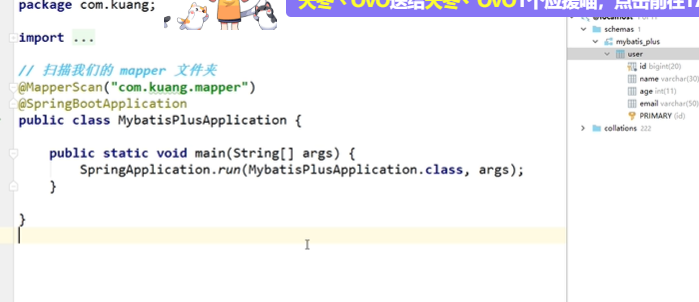
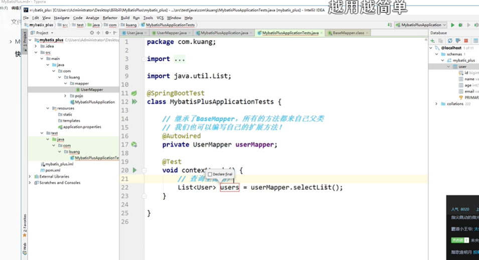
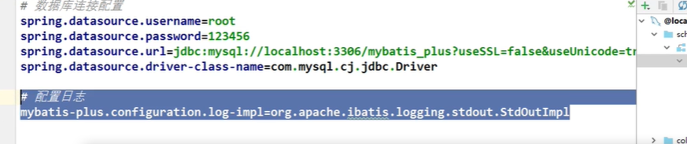
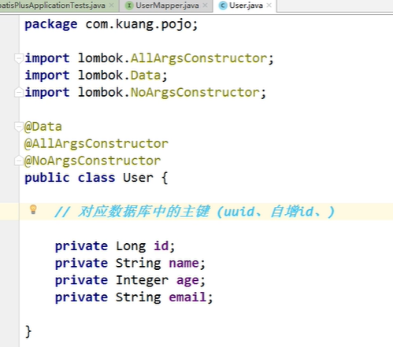
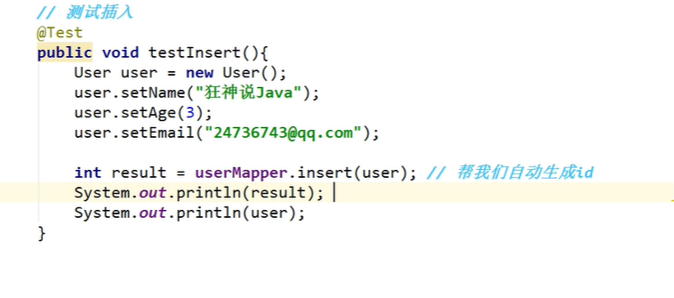
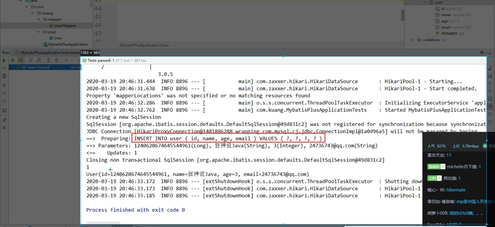
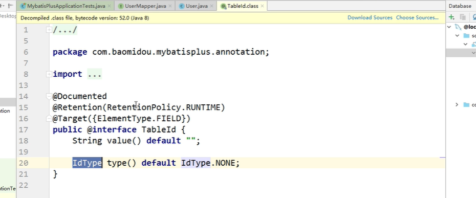
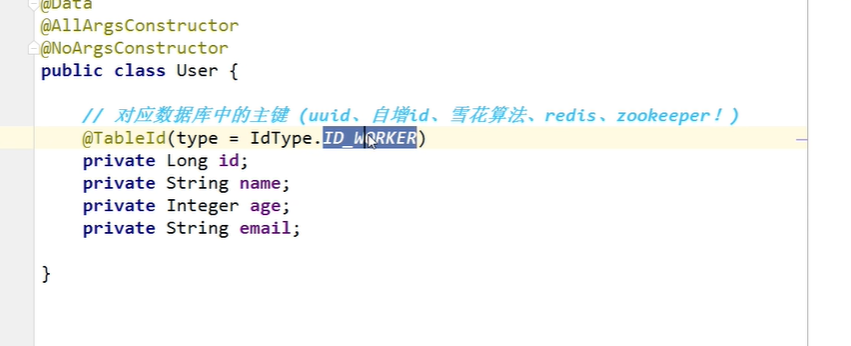

https://mp.baomidou.com/


## 简介

* [MyBatis-Plus](https://github.com/baomidou/mybatis-plus)（简称 MP）是一个 [MyBatis](http://www.mybatis.org/mybatis-3/) 的增强工具，在 MyBatis 的基础上只做增强不做改变，为简化开发、提高效率而生。

## 特性

- **无侵入**：只做增强不做改变，引入它不会对现有工程产生影响，如丝般顺滑
- **损耗小**：启动即会自动注入基本 CURD，性能基本无损耗，直接面向对象操作
- **强大的 CRUD 操作**：内置通用 Mapper、通用 Service，仅仅通过少量配置即可实现单表大部分 CRUD 操作，更有强大的条件构造器，满足各类使用需求
- **支持 Lambda 形式调用**：通过 Lambda 表达式，方便的编写各类查询条件，无需再担心字段写错
- **支持主键自动生成**：支持多达 4 种主键策略（内含分布式唯一 ID 生成器 - Sequence），可自由配置，完美解决主键问题
- **支持 ActiveRecord 模式**：支持 ActiveRecord 形式调用，实体类只需继承 Model 类即可进行强大的 CRUD 操作
- **支持自定义全局通用操作**：支持全局通用方法注入（ Write once, use anywhere ）
- **内置代码生成器**：采用代码或者 Maven 插件可快速生成 Mapper 、 Model 、 Service 、 Controller 层代码，支持模板引擎，更有超多自定义配置等您来使用
- **内置分页插件**：基于 MyBatis 物理分页，开发者无需关心具体操作，配置好插件之后，写分页等同于普通 List 查询
- **分页插件支持多种数据库**：支持 MySQL、MariaDB、Oracle、DB2、H2、HSQL、SQLite、Postgre、SQLServer 等多种数据库
- **内置性能分析插件**：可输出 Sql 语句以及其执行时间，建议开发测试时启用该功能，能快速揪出慢查询
- **内置全局拦截插件**：提供全表 delete 、 update 操作智能分析阻断，也可自定义拦截规则，预防误操作

## 快速入门

地址：[https://mp.baomidou.com/guide/quick-start.html#%E5%88%9D%E5%A7%8B%E5%8C%96%E5%B7%A5%E7%A8%8B](https://mp.baomidou.com/guide/quick-start.html#初始化工程)

使用第三方组件：

1.导入对应的依赖

2.研究依赖如何配置

3.代码如何编写

4.提高

### 一、步骤

#### 1.创建数据库 mybatis_plus

2.创建user表

```sql
DROP TABLE IF EXISTS user;

CREATE TABLE user
(
	id BIGINT(20) NOT NULL COMMENT '主键ID',
	name VARCHAR(30) NULL DEFAULT NULL COMMENT '姓名',
	age INT(11) NULL DEFAULT NULL COMMENT '年龄',
	email VARCHAR(50) NULL DEFAULT NULL COMMENT '邮箱',
	PRIMARY KEY (id)
);

```


插入数据

```sql
INSERT INTO user (id, name, age, email) VALUES
(1, 'Jone', 18, 'test1@baomidou.com'),
(2, 'Jack', 20, 'test2@baomidou.com'),
(3, 'Tom', 28, 'test3@baomidou.com'),
(4, 'Sandy', 21, 'test4@baomidou.com'),
(5, 'Billie', 24, 'test5@baomidou.com');
```





4.导入依赖

5.链接数据库








1.SQL是谁帮我峨嵋你写的

2.方法是哪里来的


## 配置日志






## CRUD扩展





### 主键生成策略

https://www.cnblogs.com/haoxinyue/p/5208136.html

雪花算法:

snowflake是Twitter开源的分布式ID生成算法，结果是一个long型的ID。其核心思想是：使用41bit作为毫秒数，10bit作为机器的ID（5个bit是数据中心，5个bit的机器ID），12bit作为毫秒内的流水号（意味着每个节点在每毫秒可以产生 4096 个 ID），最后还有一个符号位，永远是0。具体实现的代码可以参看https://github.com/twitter/snowflake。






1.实体类字段自增

```java
@TableId(type = IdType.AUTO)
```

2.数据库字段也要改成自增